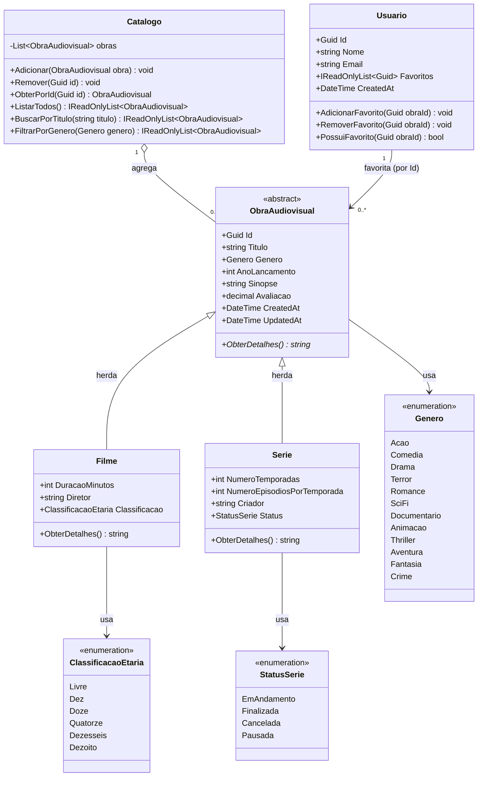
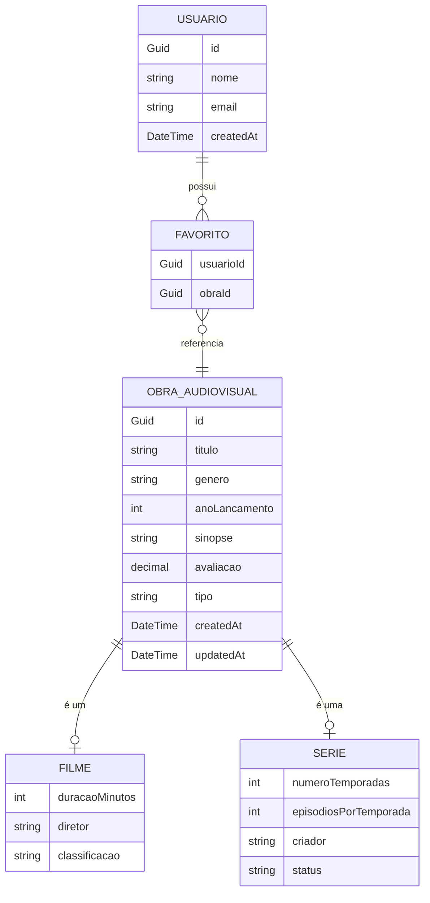
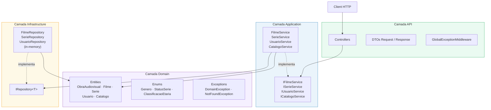
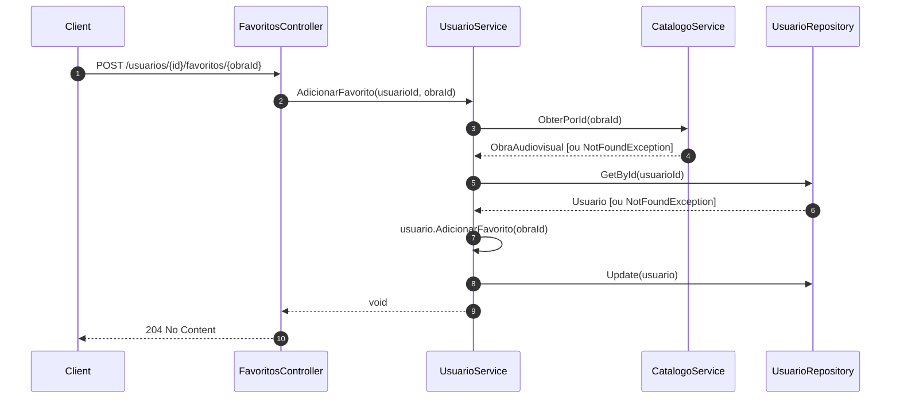
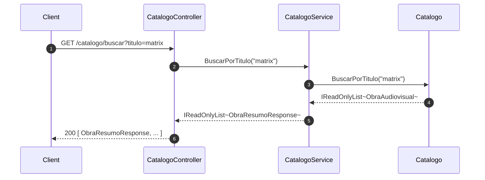

# UML — Catálogo de Filmes e Séries

---

## 1. Diagrama de Classes — Domínio Completo

---

## 2. Diagrama de Relacionamentos

---

## 3. Arquitetura em Camadas

---

## 4. Fluxo — Adicionar Favorito

---

## 5. Fluxo — Busca no Catálogo

